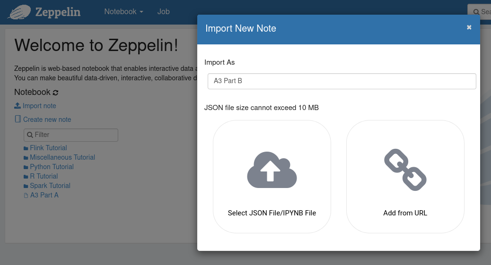

# hey-spark

Starting repository for RU Big Data assignments A3 parts A and B.

## Blog post

+ [assignment 3 blogpost](PLACEHOLDER).

Remember to update this README file with a link to the published blog post when you are done!

## The assignment

First look at the assignment:

+ [Assignment](https://rubigdata.github.io/course/assignments/A3-sparkling-spark.html)

Create a docker container for this assignment:

    docker create --name hey-spark -it -p 8080:8080 -p 9001:9001 -p 4040:4040 rubigdata/course:a3
    docker start hey-spark

You can see what's happening by attaching to the container; detach using the `^p^q` key sequence
(avoid `^C` because Zeppelin will stop):

    docker attach hey-spark

Connect to the [Zeppelin UI](http://localhost:9001) from your browser, import the notebooks,
and learn more about RDDs that you ever dreamed of (or ever wanted to know ;-)).

Screenshot from importing a notebook below; type the desired name, click on JSON and select 
the corresponding `.zpln` file from your cloned assignment repository using the file browser.

